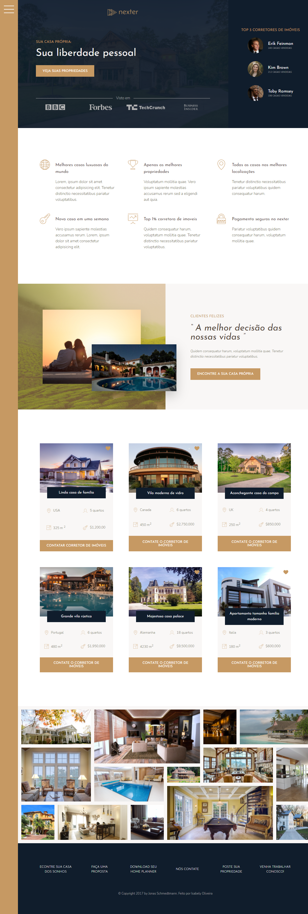

<h1 align="center"> Nexter </h1>

<h1> 
    Versão desktop
     
</h1>

<h1> 
    Versão Mobile
     
</h1>

# Indice

- [ About ](#-About)
- [ Tecnologias utilizadas ](#-Tecnologias-utilizadas)
- [ Como baixar o projeto ](#-Baixar-o-projeto)

---
### 🌴 About

Aplicação com foco em grid

---
### 🚀 Tecnologias utilizadas 

O projeto foi desenvolvido utilizando as seguintes tecnologias

- html
- css avançado [ animações, pseudoelementos, transform, transition, variaveis, flexbox ]
- sass [ mixins, variaveis, funções ]

---
### 📂 Baixar o projeto 

```bash
    # Clonar o repositório
    $ git clone https://github.com/IsabelyDev/Nexter

    # Entrar no diretório do projeto
    $ cd Nexter

```

---
Desenvolvido 💜  por Isabely Oliveira 
